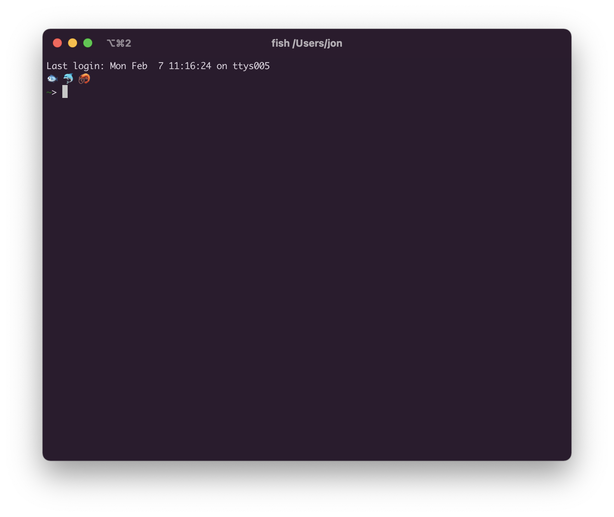

# under-the-sea
🐠 🐡 🐢

Be greeted by a selection of random marine creatures on every new Fish shell.



## Install
At the top of your `~/.config/fish/config.fish`,

```
$EDITOR ~/.config/fish/config.fish
```

place the following:

```fish
if string match -qir '.*\.utf-?8' -- $LANG $LC_CTYPE
    set -l animal_marine 🐳 🐋 🐬 🦭  🐟 🐠 🐡 🦈 🐙 🐚 # 🪸
    set -l animal_reptile 🐸 🐢
    set -l food_marine 🦀 🦞 🦐 🦑

    set fishes $animal_marine $animal_reptile $food_marine

    function fishes_greeting
      echo (random choice $fishes; random choice $fishes; random choice $fishes)
    end

    set fish_greeting (fishes_greeting)
end
```

On starting a new shell, you will be greeted by some fishes!
